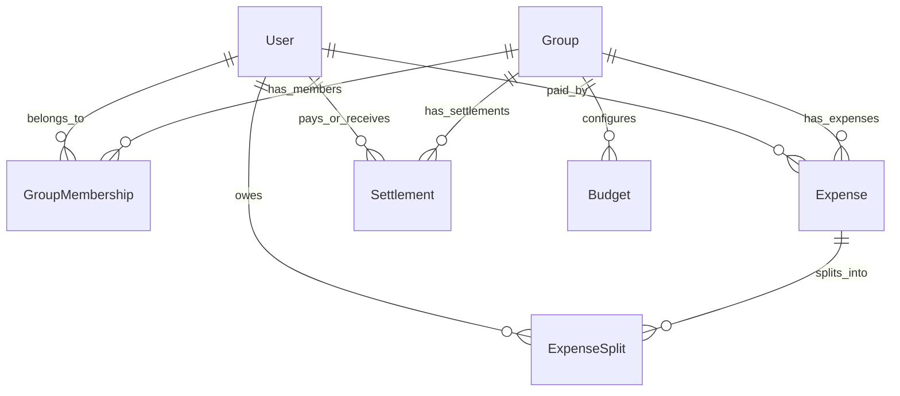

# Resolv — Architecture Details

This document covers the system design and architecture of the **Resolv** application, detailing the database schema, table layouts, constraints, model layers, and system patterns.

---

## 🏗️ 1. System Pattern (Layered Architecture)

Resolv uses a clean, decoupled layered design strictly enforced on the backend:

```
┌───────────────────────────────────────────────┐
│              HTTP Presentation                │  ← views.py, serializers.py
└───────────────────────┬───────────────────────┘
                        │ (HTTP Validated Request Payload)
                        ▼
┌───────────────────────────────────────────────┐
│                 Service Layer                 │  ← services.py (Business Logic, Transactions)
└───────────────────────┬───────────────────────┘
                        │ (Model Queries and Saves)
                        ▼
┌───────────────────────────────────────────────┐
│                Database Models                │  ← models.py (Schema Constraints, Managers)
└───────────────────────────────────────────────┘
```

* **Thin Views:** Views handle routing, authorization checks, and parse query params. They contain no logic.
* **Fat Services:** All transactions, calculations (e.g., split allocations, settlements, reliability adjustments), and validation logic are housed in service functions.
* **Dumb Models:** Models define database constraints and soft-delete methods. They do not run complex business queries.

---

## 🗄️ 2. Database Schema (Table Details)

The database schema utilizes structural check constraints and index protections to enforce financial and relationship integrity.



### 2.1 Custom `User` Table (`users_customuser`)
Extends Django's AbstractUser to track reliability metrics and preferences.

| Field | Type | Options / Attributes | Description |
|---|---|---|---|
| `id` | BigAutoField | Primary Key | Auto-incrementing identifier |
| `username` | VarChar(150) | Unique | Custom username identifier |
| `email` | VarChar(254) | Unique | User email address |
| `reliability_score` | Decimal(5, 2) | Default: `70.00` | Capped between `0.00` and `100.00` |
| `currency_preference`| VarChar(3) | Default: `INR` | Three-letter ISO code |

---

### 2.2 `Group` Table (`groups_group`)
Organizes collaborative spending entities.

| Field | Type | Options / Attributes | Description |
|---|---|---|---|
| `id` | BigAutoField | Primary Key | Auto-incrementing identifier |
| `name` | VarChar(100) | Required | Group name |
| `currency` | VarChar(3) | Default: `INR` | Active currency for balance calculations |
| `emoji` | VarChar(10) | Nullable | Visual icon for dashboard rendering |
| `description` | TextField | Nullable | Optional details about group purpose |
| `invite_code` | VarChar(20) | Unique | Random string used for joining |
| `admin` | ForeignKey | `PROTECT` on delete | FK to CustomUser |
| `created_at` | DateTime | Auto_Now_Add | Creation timestamp |
| `is_active` | Boolean | Default: `True` | Soft-delete state tracker |

---

### 2.3 `GroupMembership` Table (`groups_groupmembership`)
Tracks relationships, dates joined, and roles within groups.

| Field | Type | Options / Attributes | Description |
|---|---|---|---|
| `id` | BigAutoField | Primary Key | Auto-incrementing identifier |
| `group` | ForeignKey | `CASCADE` on delete | FK to Group |
| `user` | ForeignKey | `CASCADE` on delete | FK to CustomUser |
| `role` | VarChar(10) | Choices: `ADMIN`, `MEMBER` | Member capabilities |
| `joined_at` | DateTime | Auto_Now_Add | Join timestamp |

* **Unique Constraints:** `unique_group_membership` prevents a user from joining the same group multiple times.

---

### 2.4 `Expense` Table (`expenses_expense`)
Stores transaction details, total amounts, and categorizations.

| Field | Type | Options / Attributes | Description |
|---|---|---|---|
| `id` | BigAutoField | Primary Key | Auto-incrementing identifier |
| `title` | VarChar(100) | Required | Description of expense |
| `amount` | Decimal(12, 2)| `CHECK: amount > 0` | Total cost |
| `group` | ForeignKey | `CASCADE` on delete | FK to Group |
| `paid_by` | ForeignKey | `PROTECT` on delete | User who paid the bill |
| `split_type` | VarChar(10) | `EQUAL`, `EXACT`, `PERCENT`, `ITEM` | Algorithmic logic mapping |
| `category` | VarChar(20) | `FOOD`, `TRAVEL`, `HOUSING`, etc. | Categorization for analytics |
| `date` | Date | Default: Today | Transacted date |
| `is_active` | Boolean | Default: `True` | Soft-delete tracker |

---

### 2.5 `ExpenseSplit` Table (`expenses_expensesplit`)
Tracks individual shares owed for each expense.

| Field | Type | Options / Attributes | Description |
|---|---|---|---|
| `id` | BigAutoField | Primary Key | Auto-incrementing identifier |
| `expense` | ForeignKey | `CASCADE` on delete | FK to parent Expense |
| `user` | ForeignKey | `PROTECT` on delete | Member owing money |
| `amount_owed` | Decimal(12, 2)| `CHECK: amount_owed >= 0` | User's exact obligation share |

* **Unique Constraints:** `unique_user_expense_split` ensures a user only has one split record per expense.

---

### 2.6 `Settlement` Table (`expenses_settlement`)
Tracks debt settlements between group members.

| Field | Type | Options / Attributes | Description |
|---|---|---|---|
| `id` | BigAutoField | Primary Key | Auto-incrementing identifier |
| `group` | ForeignKey | `CASCADE` on delete | FK to Group |
| `payer` | ForeignKey | `PROTECT` on delete | Member paying the debt |
| `receiver` | ForeignKey | `PROTECT` on delete | Member receiving the money |
| `amount` | Decimal(12, 2)| `CHECK: amount > 0` | Amount paid |
| `status` | VarChar(10) | `PENDING`, `CONFIRMED`, `CANCELLED` | Lifecycle state |
| `created_at` | DateTime | Auto_Now_Add | Creation timestamp |
| `is_active` | Boolean | Default: `True` | Soft-delete tracker |

* **Check Constraints:** `check_payer_not_receiver` blocks self-settlements.

---

### 2.7 `Budget` Table (`analytics_budget`)
Allows users to configure spending goals.

| Field | Type | Options / Attributes | Description |
|---|---|---|---|
| `id` | BigAutoField | Primary Key | Auto-incrementing identifier |
| `user` | ForeignKey | `CASCADE` on delete | Owner of budget configuration |
| `group` | ForeignKey | `CASCADE`, Nullable | Optional group constraint filter |
| `category` | VarChar(20) | Default: `GENERAL` | Category mapping limit |
| `amount_limit` | Decimal(12, 2)| `CHECK: amount_limit > 0` | Cap limit |
| `month` | Integer | Capped `1-12` | Month of allocation |
| `year` | Integer | Capped `2000-2100` | Year of allocation |

* **Unique Constraints:** `unique_budget_per_user_category_time` blocks overlapping limit definitions.
